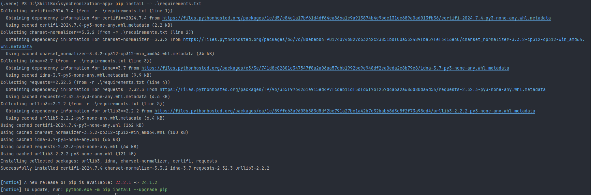

# Synchronization-app - приложение для синхронизации файлов в папке

### 1. Для работы необходимо установить необходимые зависимости командой 
        pip install -r requirements.txt

### 2. В файле config.ini необходимо произвести первоначальную настройку параметров
### (путь к папке синхронизации на локальной машине и на удаленном диске, 
### токен, частота синхронизации, путь к файлу с логами) 
### При указании путей необходима запись формата "some_folder/some/folder2/"

### 3. При синхронизации пишется лог файл

### 4. Для запуска использовать команду 
        python3 main.py

